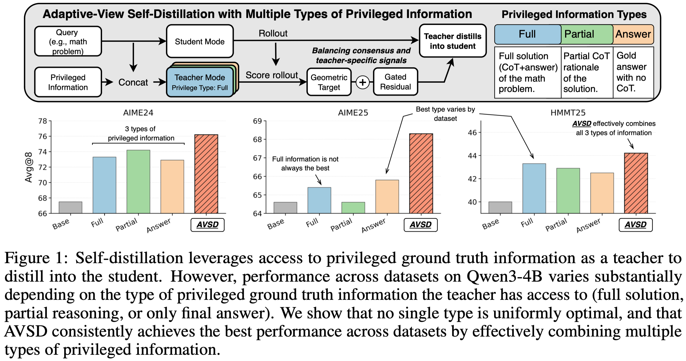

# AVSD: Adaptive-View Self-Distillation

This repository contains the code for the paper **[AVSD: Adaptive-View Self-Distillation by Balancing Consensus and Teacher-Specific Privileged Signals](https://arxiv.org/abs/2605.20643)**.

**Authors:** Duy Nguyen<sup>1</sup>, Hanqi Xiao<sup>1</sup>, Archiki Prasad<sup>1</sup>, Zaid Khan<sup>1</sup>, Anirban Das<sup>2</sup>, Austin Zhang<sup>2</sup>, Sambit Sahu<sup>2</sup>, Hyunji Lee<sup>1</sup>, Elias Stengel-Eskin<sup>3</sup>, Mohit Bansal<sup>1</sup>

<sup>1</sup>UNC Chapel Hill, <sup>2</sup>Capital One, <sup>3</sup>The University of Texas at Austin



AVSD is a multi-view self-distillation framework that uses multiple forms of privileged information, such as full solutions, partial rationales, and final answers, to construct better token-level supervision than any single privileged teacher. It decomposes the teacher signal into stable cross-view consensus and view-specific residual support, then uses a gate to add residual information only when it is aligned and proportionate to the consensus.

## Repository Structure

```text
.
├── assets/
│   └── figure1.png
├── configs/
│   └── accelerate.yaml
├── scripts/
│   ├── code/
│   │   ├── download_codeforces_cots_py.sh
│   │   ├── train_avsd_code_deepseek_r1_distill_qwen_7b.sh
│   │   └── train_avsd_code_qwen3_8b.sh
│   └── math/
│       ├── train_avsd_deepseek_r1_distill_qwen_7b.sh
│       └── train_avsd_qwen3_8b.sh
├── src/avsd/
│   ├── common/
│   ├── code/
│   └── math/
├── environment.yml
├── pyproject.toml
└── README.md
```

## Setup

```bash
conda env create -f environment.yml
conda activate avsd
pip install -e .
pip install flash-attn==2.8.3 --no-build-isolation
```

## Training Details

The training scripts use `accelerate launch` with the DeepSpeed configuration in `configs/accelerate.yaml`. The provided config runs local multi-GPU training with bf16 mixed precision and DeepSpeed ZeRO stage 2, with CPU optimizer offload enabled. By default, the scripts launch four processes.

Rollout generation is handled by vLLM during training. The scripts enable `--use_vllm` with colocated mode, so vLLM shares the training nodes/GPUs. The default vLLM settings reserve a fraction of GPU memory for generation with `--vllm_gpu_memory_utilization 0.4`, use tensor parallel size 1, and periodically synchronize weights from the trainer to the generation engine.

The scripts train with LoRA adapters by default (`--use_peft`, rank 64, alpha 128) and use flash attention, bf16 weights, gradient checkpointing, and sampled-token AVSD distillation.

## Math Experiments

### Training

Train Qwen3-8B:

```bash
bash scripts/math/train_avsd_qwen3_8b.sh
```

Train DeepSeek-R1-Distill-Qwen-7B:

```bash
bash scripts/math/train_avsd_deepseek_r1_distill_qwen_7b.sh
```

Both scripts use the OpenThought math dataset by default and write checkpoints under `outputs/avsd/`.

### Evaluation

Example of math evaluation on AIME 2025 using checkpoint 200:

```bash
python -m avsd.math.evaluate \
  --base_model Qwen/Qwen3-8B \
  --checkpoint_dir outputs/avsd/qwen3_8b/qwen3_8b_avsd/checkpoint-200 \
  --dataset aime25 \
  --output_file results/math/aime25_qwen3_8b_avsd.json
```

Supported math datasets are `aime24`, `aime25`, and `hmmt25`.

## Code Experiments

### Data Preparation

Download Python Codeforces-CoTs examples:

```bash
bash scripts/code/download_codeforces_cots_py.sh
```

Prepare static code privileged views:

```bash
python -m avsd.code.prepare_code_views \
  --input data/codeforces_cots_py_train.jsonl \
  --output data/codeforces_cots_py_train_views.jsonl
```

By default, the downloader writes `data/codeforces_cots_py_train.jsonl` and `data/codeforces_cots_py_eval.jsonl`. Generated JSONL files are intentionally ignored by Git.

### Training

Train Qwen3-8B on Codeforces:

```bash
bash scripts/code/train_avsd_code_qwen3_8b.sh
```

Train DeepSeek-R1-Distill-Qwen-7B on Codeforces:

```bash
bash scripts/code/train_avsd_code_deepseek_r1_distill_qwen_7b.sh
```

Both scripts expect `data/codeforces_cots_py_train_views.jsonl` by default and write checkpoints under `outputs/code_avsd/`.

### Evaluation

Example of code evaluation using checkpoint 200:

```bash
python -m avsd.code.evaluate_codeforces \
  --model Qwen/Qwen3-8B \
  --checkpoint-dir outputs/code_avsd/qwen3_8b/qwen3_8b_code_avsd/checkpoint-200 \
  --dataset data/codeforces_cots_py_eval.jsonl \
  --output results/codeforces/qwen3_8b_avsd.jsonl \
  --tests hidden \
  --num-samples 8
```

## Acknowledgements

This codebase builds on the OPSD implementation at <https://github.com/siyan-zhao/OPSD>. We thank the OPSD authors for releasing their trainer and self-distillation infrastructure.

## Citation

If you find our work useful in your research, please consider citing our paper:

```bibtex
@article{nguyen2026avsd,
  title={AVSD: Adaptive-View Self-Distillation by Balancing Consensus and Teacher-Specific Privileged Signals},
  author={Nguyen, Duy and Xiao, Hanqi and Prasad, Archiki and Khan, Zaid and Das, Anirban and Zhang, Austin and Sahu, Sambit and Lee, Hyunji and Stengel-Eskin, Elias and Bansal, Mohit},
  journal={arXiv preprint arXiv:2605.20643},
  year={2026}
}
```
